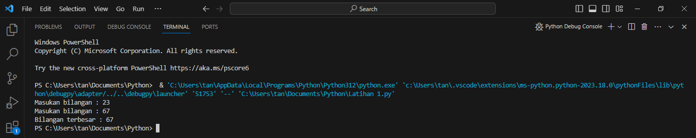
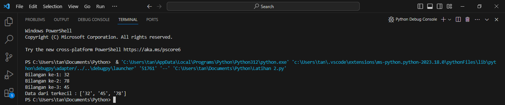
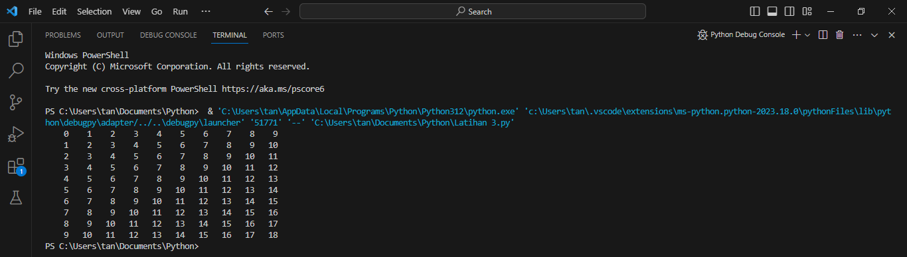
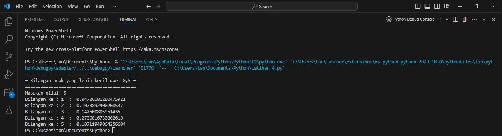

# Pertemuan ke 7

## Profil
| Variable | Isi |
| -------- | --- |
| **Nama** | Intan Virginia Aulia Putri |
| **NIM** | 312310657 |
| **Kelas** | TI.23.A.6 |
| **Mata Kuliah** | Bahasa Pemrograman |

### Latihan 1
Buat program sederhada dengan input 2 buah bilangan, kemudian tentukan bilangan terbesar dari kedua bilangan tersebut menggunakan statement if
``` Python
bil1 = input("Masukan bilangan : ")
bil2 = input("Masukan bilangan : ")

if (bil1 > bil2):
   print("Bilangan terbesar :",bil1)

if (bil1 < bil2):
   print("Bilangan terbesar :",bil2)
```

#### Tampilan output


### Latihan 2
Buat program untuk mengurutkan data berdasarkan input sejumlah data (minimal 3 variable input atau lebih), kemudian tampilkan hasilnya secara berurutan mulai dari data terkecil
``` Python
bil1 = input("Bilangan ke-1: ")
bil2 = input("Bilangan ke-2: ")
bil3 = input("Bilangan ke-3: ")

data = [bil1, bil2, bil3]

list.sort(data)
print("Data dari terkecil :", data)
```
`list.sort()` digunakan untuk mengurutkan elemen-elemen dalam sebuah list secara in-place, yang berarti list asli akan diubah dan tidak ada objek list baru yang dibuat

#### Tampilan output


### Latihan 3
Buat program dengan perulangan bertingkat (nested) for
``` Python
baris = 10
kolom = baris

for bar in range(baris):
    for col in range(kolom):
        tab = bar+col
        print("{0:>5}".format(tab), end='')
    print()
```
Penjelasan
1. `baris = 10`: Membuat variabel `baris` dan memberinya nilai 10
2. `kolom = baris`: Membuat variabel `kolom` dan memberinya nilai yang sama dengan `baris`
3. `for bar in range(baris):`: Melakukan iterasi dari 0 hingga `baris-1` menggunakan variabel `bar`
4. `for col in range(kolom):`: Melakukan iterasi dari 0 hingga `kolom-1` menggunakan variabel `col`
5. `tab = bar + col`: Menambahkan nilai `bar` dan `col` untuk mendapatkan nilai untuk dicetak
6. `print("{0:>5}".format(tab), end='')`: Mencetak nilai `tab` dengan lebar lapangan sebesar 5 karakter dan rata kanan (right-aligned)
   
#### Tampilan output


### Latihan 2
- Tampilkan n bilangan acak yang lebih kecil dari 0.5
- nilai n diisi pada saat runtime
- anda bisa menggunakan kombinasi while dan for untuk menyelesaikannya
``` Python
import random
print("===========================================")
print("= Bilangan acak yang lebih kecil dari 0,5 =")
print("===========================================")

jum = int( input("Masukan nilai: "))
i = 0
while i in range(jum):
    i += 1
    angkarandom = random.uniform(0,0.5)
    print("Bilangan ke :", i, " : ", angkarandom)
```
Penjelasan
1. `import random`: Mengimpor modul `random` yang menyediakan fungsi-fungsi untuk menghasilkan angka acak
2. Mencetak garis-garis pemisah sebagai tampilan awal
3. `jum = int(input("Masukkan nilai: "))`: Menerima input dari pengguna untuk menentukan berapa kali iterasi akan dilakukan
4. `i = 0`: Inisialisasi variabel `i` untuk menghitung iterasi
5. `while i in range(jum):`: Loop `while` akan dijalankan selama `i` berada dalam rentang 0 hingga `jum-1`
6. `i += 1`: Meningkatkan nilai `i` setiap kali loop dijalankan
7. `angkarandom = random.uniform(0, 0.5)`: Menghasilkan bilangan acak antara 0 dan 0,5 menggunakan fungsi `random.uniform`
8. `print("Bilangan ke:", i, ":", angkarandom)`: Mencetak nomor iterasi dan bilangan acak yang dihasilkan

#### Tampilan output

